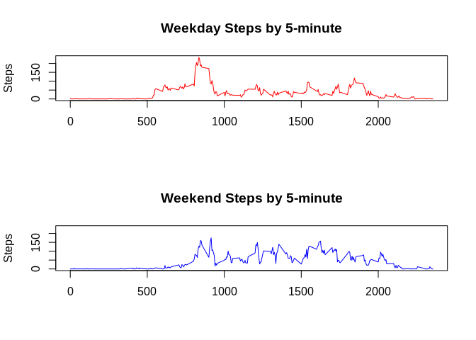

# Reproducible Research: Peer Assessment 1


```r
# Set dir
setwd("/home/carlos/coursera/R/Reproducible_Research/week02/")

# Download file and unzip
#temp <- tempfile()
#download.file("https://github.com/ceggithub/RepData_PeerAssessment1/raw/master/activity.zip", temp)
#unzip(temp)
#unlink(temp)

# Load data
activity <- read.csv2(file = "activity.csv", header = TRUE, sep = ',', na.strings = "NA" )
activity$date <- strptime(activity$date, format = "%Y-%m-%d")

# Sum, Mean and Median steps by day
byday <- ddply(activity,~date,summarise,sum=sum(steps), mean=mean(steps, na.rm = TRUE), median=median(steps, na.rm = TRUE))

# Mean and Median steps by time series
byfiveminutes <- ddply(activity, ~interval, summarise, mean=mean(steps, na.rm = TRUE), median=median(steps, na.rm = TRUE))
```

## What is mean total number of steps taken per day?
<!-- -->

### Results by day

```
##          date   sum       mean median
## 1  2012-10-01    NA        NaN     NA
## 2  2012-10-02   126  0.4375000      0
## 3  2012-10-03 11352 39.4166667      0
## 4  2012-10-04 12116 42.0694444      0
## 5  2012-10-05 13294 46.1597222      0
## 6  2012-10-06 15420 53.5416667      0
## 7  2012-10-07 11015 38.2465278      0
## 8  2012-10-08    NA        NaN     NA
## 9  2012-10-09 12811 44.4826389      0
## 10 2012-10-10  9900 34.3750000      0
## 11 2012-10-11 10304 35.7777778      0
## 12 2012-10-12 17382 60.3541667      0
## 13 2012-10-13 12426 43.1458333      0
## 14 2012-10-14 15098 52.4236111      0
## 15 2012-10-15 10139 35.2048611      0
## 16 2012-10-16 15084 52.3750000      0
## 17 2012-10-17 13452 46.7083333      0
## 18 2012-10-18 10056 34.9166667      0
## 19 2012-10-19 11829 41.0729167      0
## 20 2012-10-20 10395 36.0937500      0
## 21 2012-10-21  8821 30.6284722      0
## 22 2012-10-22 13460 46.7361111      0
## 23 2012-10-23  8918 30.9652778      0
## 24 2012-10-24  8355 29.0104167      0
## 25 2012-10-25  2492  8.6527778      0
## 26 2012-10-26  6778 23.5347222      0
## 27 2012-10-27 10119 35.1354167      0
## 28 2012-10-28 11458 39.7847222      0
## 29 2012-10-29  5018 17.4236111      0
## 30 2012-10-30  9819 34.0937500      0
## 31 2012-10-31 15414 53.5208333      0
## 32 2012-11-01    NA        NaN     NA
## 33 2012-11-02 10600 36.8055556      0
## 34 2012-11-03 10571 36.7048611      0
## 35 2012-11-04    NA        NaN     NA
## 36 2012-11-05 10439 36.2465278      0
## 37 2012-11-06  8334 28.9375000      0
## 38 2012-11-07 12883 44.7326389      0
## 39 2012-11-08  3219 11.1770833      0
## 40 2012-11-09    NA        NaN     NA
## 41 2012-11-10    NA        NaN     NA
## 42 2012-11-11 12608 43.7777778      0
## 43 2012-11-12 10765 37.3784722      0
## 44 2012-11-13  7336 25.4722222      0
## 45 2012-11-14    NA        NaN     NA
## 46 2012-11-15    41  0.1423611      0
## 47 2012-11-16  5441 18.8923611      0
## 48 2012-11-17 14339 49.7881944      0
## 49 2012-11-18 15110 52.4652778      0
## 50 2012-11-19  8841 30.6979167      0
## 51 2012-11-20  4472 15.5277778      0
## 52 2012-11-21 12787 44.3993056      0
## 53 2012-11-22 20427 70.9270833      0
## 54 2012-11-23 21194 73.5902778      0
## 55 2012-11-24 14478 50.2708333      0
## 56 2012-11-25 11834 41.0902778      0
## 57 2012-11-26 11162 38.7569444      0
## 58 2012-11-27 13646 47.3819444      0
## 59 2012-11-28 10183 35.3576389      0
## 60 2012-11-29  7047 24.4687500      0
## 61 2012-11-30    NA        NaN     NA
```


## What is the average daily activity pattern?

Average maximum occurs within: 835

<!-- -->


## Imputing missing values

Missing are 2304 rows

This missing data will are filled by median of the 5-minute period.


### The new data look

<!-- -->

Results by day with missed filled

How to fill the average of the values it was high


```
##          date   sum       mean median
## 1  2012-10-01  1141  3.9618056      0
## 2  2012-10-02   126  0.4375000      0
## 3  2012-10-03 11352 39.4166667      0
## 4  2012-10-04 12116 42.0694444      0
## 5  2012-10-05 13294 46.1597222      0
## 6  2012-10-06 15420 53.5416667      0
## 7  2012-10-07 11015 38.2465278      0
## 8  2012-10-08  1141  3.9618056      0
## 9  2012-10-09 12811 44.4826389      0
## 10 2012-10-10  9900 34.3750000      0
## 11 2012-10-11 10304 35.7777778      0
## 12 2012-10-12 17382 60.3541667      0
## 13 2012-10-13 12426 43.1458333      0
## 14 2012-10-14 15098 52.4236111      0
## 15 2012-10-15 10139 35.2048611      0
## 16 2012-10-16 15084 52.3750000      0
## 17 2012-10-17 13452 46.7083333      0
## 18 2012-10-18 10056 34.9166667      0
## 19 2012-10-19 11829 41.0729167      0
## 20 2012-10-20 10395 36.0937500      0
## 21 2012-10-21  8821 30.6284722      0
## 22 2012-10-22 13460 46.7361111      0
## 23 2012-10-23  8918 30.9652778      0
## 24 2012-10-24  8355 29.0104167      0
## 25 2012-10-25  2492  8.6527778      0
## 26 2012-10-26  6778 23.5347222      0
## 27 2012-10-27 10119 35.1354167      0
## 28 2012-10-28 11458 39.7847222      0
## 29 2012-10-29  5018 17.4236111      0
## 30 2012-10-30  9819 34.0937500      0
## 31 2012-10-31 15414 53.5208333      0
## 32 2012-11-01  1141  3.9618056      0
## 33 2012-11-02 10600 36.8055556      0
## 34 2012-11-03 10571 36.7048611      0
## 35 2012-11-04  1141  3.9618056      0
## 36 2012-11-05 10439 36.2465278      0
## 37 2012-11-06  8334 28.9375000      0
## 38 2012-11-07 12883 44.7326389      0
## 39 2012-11-08  3219 11.1770833      0
## 40 2012-11-09  1141  3.9618056      0
## 41 2012-11-10  1141  3.9618056      0
## 42 2012-11-11 12608 43.7777778      0
## 43 2012-11-12 10765 37.3784722      0
## 44 2012-11-13  7336 25.4722222      0
## 45 2012-11-14  1141  3.9618056      0
## 46 2012-11-15    41  0.1423611      0
## 47 2012-11-16  5441 18.8923611      0
## 48 2012-11-17 14339 49.7881944      0
## 49 2012-11-18 15110 52.4652778      0
## 50 2012-11-19  8841 30.6979167      0
## 51 2012-11-20  4472 15.5277778      0
## 52 2012-11-21 12787 44.3993056      0
## 53 2012-11-22 20427 70.9270833      0
## 54 2012-11-23 21194 73.5902778      0
## 55 2012-11-24 14478 50.2708333      0
## 56 2012-11-25 11834 41.0902778      0
## 57 2012-11-26 11162 38.7569444      0
## 58 2012-11-27 13646 47.3819444      0
## 59 2012-11-28 10183 35.3576389      0
## 60 2012-11-29  7047 24.4687500      0
## 61 2012-11-30  1141  3.9618056      0
```


## Are there differences in activity patterns between weekdays and weekends?
<!-- -->

